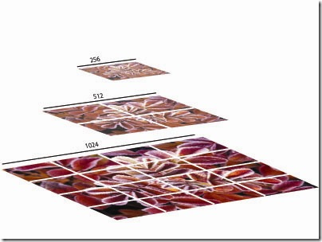

# Microscopy Image rendering

__Author's (Ilan's) note__:  This is my understanding of the problem and our solutions.  If I am mistaken, please feel free to make a pull request.  I had literally no background in imaging or rendering before taking this on, but continue to be exhilarated as problems and solutions present themselves.

## Images and Computers

On some level, images can be thought of simply as `height x width x channels` matrices containing numbers as entries.  Computers have three little lights per pixel on the monitor, each of which can take on 256 different values (0-255).  For this and definitely other reasons, most images have three (or four) `channels`, RGB (or RGBA where A controls the alpha blending), each with 256 possible values.  However, this is somewhat arbitrary - our microscopy data, for example, can have many channels, each corresponding to a different antibody staining that is imaged, and each taking on a far greater range than the standard 256 options.  Beyond microscopy, many normal DSLR cameras can take photographs that [go beyond the 256 options as well](https://www.dpbestflow.org/camera/sensor#depth).  This data (in a standard 256 bit depth format) is then often compressed (in a [lossless, like .png files via DEFLATE](https://en.wikipedia.org/wiki/Portable_Network_Graphics#Compression), or in a [lossy, like .jpeg files with the Discrete Cosine Transform](https://en.wikipedia.org/wiki/JPEG#JPEG_codec_example), manner) and ready to be transported over the internet or opened on a computer (in both cases, the data must be first decompressed before it can be viewed).

We have thus established that standard image files are 8-bit (256 value-options) `height x width x 3` or `height x width x 4` matrices, often compressed.  Our data, as noted, is different, often being 16-bit or 32-bit and taking on more than the standard 3 or 4 channels (or possibly less).

## Viewing High Resolution Images

A challenge of working in a browser is that you don't have access to data unless it is fed over the internet to you.  Thus if you have a very large image in `height` and `width`, storing the entire image in memory is tough.  For this reason, people have developed various image __tiling__/__pyramimd__ schemes. __Tiling__ is the manner in which the underlying image is broken up into smaller images and the __pyramid__ represents the image at increasingly downsampled resolutions.  This allows you to efficiently view the image in different locations at different zoom levels, given the current viewport in your browser, the most famous example of this being [OpenSeaDragon](https://openseadragon.github.io/).

 For example, if you are very zoomed in on an image, say the top-left corner of `0:512` in both height and width on the original image, you only need that portion of the image served to your browser for you to view it.  You don't need the rest of the image at this moment and should you pan to it, you can always fetch it from the server which contains the output of the __tiling__/__pyramid__ generation.

## Our Data: Problems and solutions

We thus have two main problems: our data is often in a non-standard format, and it is very large.  Therefore, we need efficient methods of rendering and serving.

#### 1. Rendering >256 bits of data per channel, with more than 3 channels

To tackle this ***we look to [WebGL](https://developer.mozilla.org/en-US/docs/Web/API/WebGL_API)***, a Javascript API for using OpenGL in the browser, as the core technology and ***also [DeckGL](https://deck.gl/#/) as the high-level API*** for our application to communicate "business logic" to WebGL.  WebGL is very flexible and will allow us to pass down data (i.e a flattened image matrix) with 16 and 32 bit precision to __shaders__, which can do graphics rendering and basic arithmetic using the GPU very efficiently (this is why deep learning works so well as it relies almost entirely on the GPU).    This extended range of 16 or 32 bits can then be mapped by the user to a subset of down to a "0 to 1" range that WebGL can render. Additionally, we can pass down a flag to tell WebGL which color each channel should be mapped to, thus allowing us to store each channel separately.

#### 2. Serving Data Efficiently

Most high resolution tiling image viewing systems rely on `jpeg` files, which can obtain 10:1 compression ratios with imperceptible loss of quality, to serve the image tiles.  The `jpeg` files are very small and therefore there is minimal bottleneck with network requests.  However, this file type/compression scheme is [not an easy option](https://caniuse.com/#feat=jpegxr) (realistically) for more than 8 bits of data per channel in current browsers (they do not ship with the decompression algorithm for more than 8 bit data), nor is it clear that we wish to lose any precision in what is essentially a scientific measurement.  The other popular image file type, `png`, achieves considerably worse compression (around 2:1) but is lossless.

Our approach to solving this is twofold.  

First, we ***store the image in a compressed, "raw" format*** that can be decoded in the browser.  For this, we currently use [zarr](https://zarr.readthedocs.io/en/stable/) with [zarr.js](https://github.com/gzuidhof/zarr.js).  __Zarr__ essentially stores matrices of data using the same algorithm as png (`DEFLATE`) but very flexibly, in that the data can be of any size, in any shape.  For our purposes, it is best to store the data as flattened image tiles, which can then be read in the client by __Zarr.js__.  Taking a step back to see why this is necessary, let us note that __WebGL__ uses flat arrays and offset parameters to know how to scan the data so it can be passed down to the shaders - therefore pre-flattening the data before it reaches the client will result in best performance.  Thus, we flatten each image array of the pyramid in `tileSize x tileSize` passes over the data using [numpy](https://numpy.org/) and then store this in a __Zarr__ file folder for efficient use.  For example, if you have a `1028x1028x3` image with `tileSize` equal to 128, the data would be converted into a `10 x 10 x 128 x 128 x 3` numpy array (i.e the top `128x128` entries of the original image becomes a block, then the next `128x128` entries and so forth), and then flattened in [row-major order](https://en.wikipedia.org/wiki/Row-_and_column-major_order) to be served to the client.  Another advantage to this is that we can store each channel separately, thereby making our individual requests smaller and our application better an switching channels on and off- to render one channel, you only have to request one channel's worth of data, instead of requesting all 3 (or 4) channels needed in a "normal" image format.  

Second, ***we make use of [HTTP2](https://en.wikipedia.org/wiki/HTTP/2)*** to speed up the requests.  Even though the requests are not particularly large (normally far less than 500kb per tile with a `512x512` tile size, 8bits of data), there are many of them and in normal HTTP, they block one another after a certain point.  __HTTP2__ more or less circumvents this blocking problem, essentially reducing the time needed to make a request by the number of requests made.  A possible extension of this is to use [gRPC](https://en.wikipedia.org/wiki/GRPC) (which uses __HTTP2__ under the hood together with [Protobuf](https://en.wikipedia.org/wiki/Protocol_Buffers)) but for now, __HTTP2__ alone works well enough.

## Pitfalls of other routes

- One possible solution is to use an already existing tiling service, like [mapbox](https://www.mapbox.com) for creating/hosting our data or __OpenSeaDragon__ with DeepZoom (or some combination of the two).  However, these services does not support high bit-depth-per-channel images.  To use these then, we could pack 32 bits per channel (for high bit-depth-per-channel microscopy images) across the total 32 bits of the RGBA of a standard image file and then serve that and decode it, doing some sort of mapping on the shaders.  Besides the kludge-y nature of this, we don't save anything really in terms of time as far as transporting the data is concerned, assuming we use `png` - we still need to serve the same amount of data.  And, if we attempted to do this with `jpeg` format, it's not even clear how the color-space transformation, DCT, and entropy encoding will react to what is no longer color values, but rather a bit packing scheme.   
- Vector tiles from __mapbox__ are another option, relying on __Protobuf__, but our data is not vector data.  This raises questions of how we can get the data into that format, and, once it is in that format, why we would not just serve it ourselves over __gRPC__ which appears to be faster.
- I am dismissing [OMERO](https://www.openmicroscopy.org/omero/) out of hand because we do not want to deal with a server that does anything beyond serving files.
- There is a high resolution image format called [OpenEXR](https://www.openexr.com/) that supports our data type somewhat natively; that is, it supports high bit-depth-per-channel natively and also supports arbitrary numbers of channels.  There is a [ported C++ library](https://github.com/disneyresearch/openexr-wrap-em) as well as a [native Javascript library](https://github.com/mrdoob/three.js/blob/45418089bd5633e856384a8c0beefced87143334/examples/jsm/loaders/EXRLoader.js#L204) for handling these files.  There are potentially others.  However, unless we use a lossy compression with them, we again don't really gain anything (of note is that __three.js'__ implementation, the aforementioned javascript library, does not support lossy compression).  A nice thing about the format, though, is that it appears to support image pyramids/tiling natively, although it is not a guarantee that any library we might use does as well (or at least easily).  There are two main potential pitfalls with EXR:
  1. The __OpenEXR__ format appears to only support three different data types (16 and 32 bit floats, and 32 bit unsigned integers), which means we probably have to kludge our data a bit and will need two different image-serving systems if we get 8-bit data; granted, making an image pyramid requires ***some*** loss of precision anyway (it is essentially a [statistical process](https://en.wikipedia.org/wiki/Pyramid_(image_processing))), so getting from native integers in the OME-TIFF to floating point is not the end of the world, but will likely require we lose precision.
  2. One of the lossy compression schemes it supports is lossy in so far as it just lops of the least significant 8 bits of data (scroll down to the data compression sections [here](https://www.openexr.com/documentation/TechnicalIntroduction.pdf)).  The others, while less hacky in this sense, do not even work for 32 bit data

## Our Solution (at a high level)
**INPUT:** An OME-TIFF file with an arbitrary number of channels and up to 32 bits of range per channel per image.  There may be many `Z` (physical space) and `T` (time) image planes in each OME-TIFF so we describe the pipeline per image per channel .  These first siz steps are only for using __Zarr__.  If you wish to use direct tiff access, the original image needs only be run through the pyramid/tiling scheme provided by libvips, and then a client side library can be employed.
  1. On a server with enough RAM, in __python__, read the image into memory as an __numpy__ array, a `rows x columns x channels` matrix and then take only one of the channels yielding a `rows x columns` matrix.
  2. Create an image pyramid using __scikit-image__.
  3. For each layer in the pyramid, pad the sides so the number of `rows` and `columns` is an even multiple of the `tileSize`.
  4. Convert each layer in the pyramid into a `(height // tileSize) x (width // tileSize) x tileSize x tileSize` array, thereby making essentially making the first two matrix dimensions indices for each tile.
  5.  Flatten this new array in __row-major-order__ thereby preserving the "tile" structure.
  6.  Write the entire array into a __zarr__ file with chunk size `tileSize * tileSize`(i.e each individual compressed file contains a flattened tile of one channel).

Then the browser can go through the following steps to get a channel of an OME-TIFF and render it:

  1. Over an __HTTP2__ connection, fetch the needed tiles stored as a compressed __zarr__ array (or directly as TIFF chunks).  That is, for tile index `x` and `y` fetch the (flattened) data spanning from `x * tileSize * tileSize * (width // tileSize) + y * tileSize * tileSize` to `x * tileSize * tileSize * (width // tileSize) + (y + 1) * tileSize * tileSize`
  2. Decompress the data and pass it into the proper __DeckGL__ `TileLayer` to be passed down to the shaders, along the with color that will represent the channel as well as the range of values to map down to the `0` to `1` range of the shaders.
  3. Once the data is on the shaders, map the values down and render.

While the pipeline is rather simple, __DeckGL__ and __HTTP2__ are doing a lot of leg work here.  This would simply not be possible to do quickly without these libraries.
